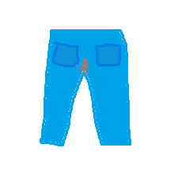

  <h1>Trouser-Streak</h1>
    
Trouser-Streak is a compilation of modules, updated to the latest version and optimized for maximum grief. I did not make most of these.

  

  

## Credits to the people I skidded from:
In no particular order
- [Meteor Client](https://github.com/meteordevelopment/meteor-client)
- [Allah-Hack](https://github.com/TaxEvasiqn/allah-hack)
- [Meteor-Rejects](https://github.com/AntiCope/meteor-rejects)
- [Frostburn Client](https://github.com/evaan/FrostBurn)
- [Banana](https://github.com/Bennooo/banana-for-everyone)
- [1.17 Crafting Dupe](https://github.com/B2H990/NUMA-117-Crafting-Dupe/)
- [InstantKillBow](https://github.com/Saturn5Vfive/InstantKillBow)
- [LecternCrash](https://github.com/Coderx-Gamer/lectern-crash)

 

    
This modpack would not have been possible without you
 

## Features:
- **Airstrike+:** Rains whatever entities you desire from a list similar to Boom. It used to only rain fireballs. (Credits to Allah-Hack) 
- **AutoBuild:** Places blocks according to placement in a 5x5 grid. You can draw pictures with it! (Credits to Banana) I modified it so it places lengthways infront of you. This way you can draw stairs and place them infront of you, hop up em and keep going.
- **AutoDrop:** Drops the stack in your selected slot automatically. You can shift click your inventory items to slot one to dump your trash easily.
- **AutoLavaCaster** Simple timer based bot for lavacasting. Aim at the top of the block you want to cast on and activate the module. It places lava, then after an amount of time removes the lava, places the water after a specified delay, removes it after a specified delay, it will build the mountain upward, tower you up and repeat. Position yourself on a block above and diagonally, mostly perpendicular from the targeted block for best results. Use the ".lavacalc" command to determine roughly how long lava will take to finish.
- *AutoLavaCaster Notes:*
- The .castertimer Command tells you how long each cycle has been running for. 
- The .lavacalc command gives you an approximation of how long lava will take to flow across a 45 degree staircase at 20TPS.
- Do not use Timer with this module.
- Rotating your character will break AutoLavaCaster. Disable rotate options in Freecam, Killaura, and any others that will rotate you when casting.
- Fish buckets, and other water buckets with entities do not work. Put the fishy somewhere safe before mountaining.
- If Build up is enabled, and not holding a block, appropriate blocks are selected from your hotbar automatically from left to right.
- Autoreplenish is recommended if building up, but disable search hotbar option.
- Do not use Flammable blocks if building up, and firespread is on.
- Reducing timing options while it's on can break it.
- **AutoMountain:** AutoMountain builds stairs in the direction you aim. It builds upward if you are looking toward the horizon or higher, and builds downward if you are looking down. (Credits to Frostburn for the base for the code, and Banana for the player centering utils.)
- *AutoMountain Controls:* 
- UseKey (Right Click) starts and pauses mountain building.
- Left and RightKeys turn Mountain building.
- ForwardKey Turns mountain up, Back Key turns mountain down.
- JumpKey adjusts spacing of stairs according to the OnDemandSpacing value. 
- **AutoStaircase:** Builds stairs upward in the direction you are facing by running forward and jumping. (Credits to Frostburn, and Banana for the player centering utils to make it work correctly) I just had to fix up some stuff for this one but Frostburn had the base code there. I believe this is the first publicly available automatic staircase builder in a Meteor addon, correct me if I'm wrong maybe I didn't have to learn some Java to do this.
- **BetterScaffold:** Give you more options for scaffolding, bigger range and others. (Credits to Meteor-Tweaks)
- **Boom+:** Throws entities when you click (Credits to Allah-Hack) I just added some more fun things you might want to throw.
- **ExplosionAura:** Spawns creepers at your position that explode as you move. Like a bigger, more laggy Nuker module for creative mode. The use of the module Velocity is recommended to avoid being thrown around.
- **HandOfGod:** Deletes the world around you as you fly, and as you click. It deletes when you press the directional keys, or when you click it fills with the specified block. Operator status required.
- **Inventory Dupe (1.17):** Duplicates things in your crafting slots when the module is enabled and the Dupe button is pressed in your inventory. (Credit to ItsVen and Da0neDatGotAway for original creation of the dupe, and to B2H990 for making the fabric mod.)
- **InstaKill:** Shoots arrows and tridents with incredible power and velocity. Enabling multiple buttons causes the amount to add up. (Credits to Saturn5Vfive)
It can also retrieve arrows and items from a distance if you shoot in that direction, I have noticed.
- **LecternCrash:** Crash 1.18.X vanilla servers and possibly below. (Credits to Coderx-Gamer)
- **Phase:** Allows you to phase through blocks vertically, and through thin blocks horizontally such as doors and world border (Credits to Meteor-Rejects) Please add this back it's not too terrible.
- **RedstoneNuker:** It's just the regular Nuker module from Meteor client, customized for only breaking things that generate redstone signals. Also with included AutoTool. To keep you safer when placing lots of TNT.
- **ShulkerDupe:** Duplicates the contents of a shulker when opening. Only works on Vanilla, Forge, and Fabric servers 1.19 and below. Use multiconnect or viafabric (Credits to Allah-Hack)
- **Teleport:** Sets your position to the targeted block, within a possible reach of 56 blocks. Rarely can cause damage, be careful.
- **TPFly:** It is a purely setPos based flight. Based off the ClickTP code, credits to Meteor for that. ***EXPERIMENTAL, movement is a little weird lol.***
- **TrouserFlight:** I just added a Normal mode antikick for Velocity flight cuz missing at the time
- **Voider:** Replaces the world from the top down (Credits to Allah-Hack) I only added options to set max and minimum height for voiding, and instead of just air it can do water and lava now too.

## Known Bugs:
- **AutoLavaCaster Bugs** 
- If you are too far out of reach it breaks.
- If view of the targeted block is obstructed it breaks.
- **AutoMountain Bugs** 
- AutoMountain can cause damage if you pause or disable the module while rubberbanding and building downward. There is a workaround included to fix this when pausing with the useKey.
- Be prepared to Die in the name of building Mountains.
- Launching a SinglePlayer world with AutoMountain enabled causes crash. Disable the AutoMountain module before loading a single player world to avoid this.
- Some blocks may cause Automountain to attempt to build while not actually placing anything (Torches, walls, and doors did this until I fixed). If a block does not work please make an issue so I can correct it.
-------------------------------------
- **Blocks That do not work at all with AutoMountain**
- SnowBlocks
- maybe more?
-------------------------------------
-**More Bugs** 
- TPFly can hurt you once in a while on disable. I tried to prevent this. You also rubberband if going toward a block because it attempts to teleport you through it.
- Adjusting  TPFly antikick values while flying can be deadly
- Normal Mode antikick for the velocity flight mode that I added can cause damage once in a while for an unknown reason.

## Requirements:
- Latest dev build of Meteor-Client
- Don't forget to update any other mods you are using if it's still crashing

## Total Download Count:
**Trouser-Streak :D**
