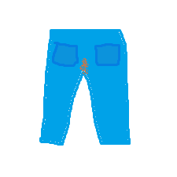

  <h1><strong><u>Trouser-Streak</u></strong></h1>
  
<strong>Official Griefing Utilities of <a href="https://www.youtube.com/@mountainsoflavainc.6913">Mountains of Lava Inc.</a></strong>

  
<strong>You can support our projects by becoming a Youtube Member: <a href="https://www.youtube.com/@mountainsoflavainc.6913/join">LINK</a></strong>

  
<strong>Trouser-Streak</strong> is a compilation of modules for <strong><a href="https://meteorclient.com/">Meteor Client</a></strong>.

  
<strong>Customer Service Discord: <a href="https://www.breakblocks.com/discord">https://www.breakblocks.com/discord</a></strong>

  

<strong><em>Updated to the latest version and optimized for maximum grief!</em></strong>

---

## <u>Features:</u>

### **[Trouser Streak Wiki](https://github.com/etianl/Trouser-Streak/wiki)**

### <u>Base Hunting Utilities!</u>

Trouser Streak is the origin of the Palette based tracing method for NewChunks, available in the **NewerNewChunks** module!

Trouser Streak also offers many base hunting features such as modules that locate un‑natural blocks, block patterns and items.  
**[TrouserHunting Modules](https://github.com/etianl/Trouser-Streak/wiki/TrouserHunting-Modules)**

### <u>Operator and Creative mode Utilities!</u>

Trouser Streak contains some of **the most dangerous** modules that I and others could come up with.

Some of these modules that use Creative mode and Operators status can destroy entire worlds in a matter of seconds.

**Anything in this category must be used with extreme caution!**  
**[TrouserOP/Creative Modules](https://github.com/etianl/Trouser-Streak/wiki/TrouserOP-Creative-Modules)**

### <u>Many Griefing Utilities and much more!</u>

Trouser Streak is home to the original **AutoMountain** module for creating lavacasts, and also the original **SpearKill and MaceKill** modules for killing players.

**The features in Trouser Streak include but are not limited to Lava Mountain making modules, modules to speed up block breaking, insta kill modules, some pvp modules, dupes, crashes, and general quality of life things.**  
**[TrouserStreak Modules](https://github.com/etianl/Trouser-Streak/wiki/TrouserStreak-Modules)**

---

***A few of these modules were not made by me!***

## Credits to the people I skidded from:

In no particular order

- All of these people [https://github.com/etianl/Trouser-Streak/graphs/contributors](https://github.com/etianl/Trouser-Streak/graphs/contributors)
- [Meteor Client](https://github.com/meteordevelopment/meteor-client)
- [Allah-Hack](https://github.com/TaxEvasiqn/allah-hack)
- [Meteor-Tweaks](https://github.com/Declipsonator/Meteor-Tweaks)
- [Meteor-Rejects](https://github.com/AntiCope/meteor-rejects)
- [Frostburn Client](https://github.com/evaan/FrostBurn)
- [Banana](https://github.com/Bennooo/banana-for-everyone) Credits for checkbox array from AutoBuild, and the idea for TrouserBuild
- [1.17 Crafting Dupe](https://github.com/B2H990/NUMA-117-Crafteks-Dupe/)
- [Book And Quill Dupe](https://github.com/Thorioum)
- [InstantKillBow](https://github.com/Saturn5Vfive/InstantKillBow)
- [LecternCrash](https://github.com/Coderx-Gamer/lectern-crash)
- [etianl](https://github.com/etianl/)

**This modpack would not have been possible without you.**

---

## <u>Requirements:</u>
- Meteor Client [https://meteorclient.com/](https://meteorclient.com/)
- Fabric API [https://github.com/FabricMC/fabric-api](https://github.com/FabricMC/fabric-api)
- Please try [ViaFabricPlus](https://github.com/FlorianMichael/ViaFabricPlus) to connect to old servers from a new version client.

plz give me star on githoob kthx
